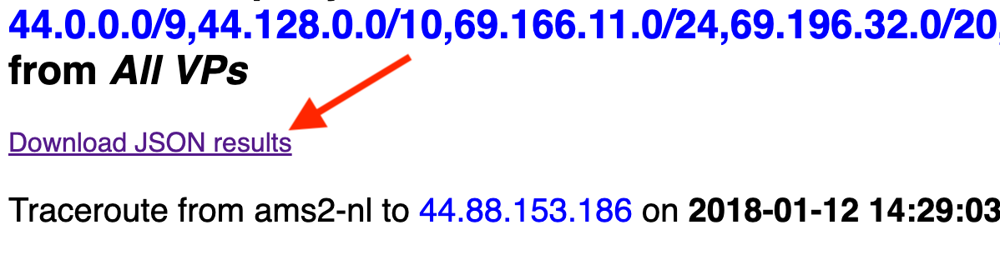

~~~json
{
  "name": "How to find the IP paths into an organization from Ark?",
  "description": "This will provide a recipe to find a company's prefixes and the IP paths from CAIDA's ark to those prefixes.",
  "links": [
    {
      "to": "dataset:bgptools"
    },
    {
      "to": "software:fantail"
    }
  ],
  "id": "how_to_find_the_ip_paths_into_an_organization_from_ark",
  "name": "How to find the origin ASN for a IPv4 address with Python?",
  "tags": [
    "measurement methodology",
    "topology",
    "software/tools",
    "ipv4",
    "ipv4 prefix"
  ],
  "authors":[
        {
            "person": "person:huffaker_bradley",
            "organizations": [ "CAIDA, San Diego Supercomputer Center, University of California San Diego" ]
        }
    ]
}
~~~
### Introduction
We will be using BGPTools to identify the set of prefixes that are announced by the organization, and 
Fantail to collect the Ark traces to the those prefixes.

### Collect Prefixes  (bgptools)
- Go to **bgp.tools** and type the organization name into the "Start here..." field. 
  

    
  

- Choose the best **AS number** on in the "Item" column for your organization.
  

    
  

- Download **https://bgp.tools/table.txt** and get all the prefixes for **AS number**. 
  ~~~
  wget https://bgp.tools/table.txt
  grep ' 7377$' table-14-03-24.txt | grep -v ':' | cut -f 1 -d ' ' - | tr '\n' ',' | sed 's/.\{1\}$//' > prefixes.txt 
  ~~~ 

### Collect Traces (fantail) 
- Log into **fantail.caida.org** and select **Query traceroute paths**
  

    
  

- Inside the **Query** box, set **Method** to **[ ] dest** and copy/paste the prefixes from
  **prefixes.txt** file into the **Target Address/Prefix** field. 
  

    
  

- Wait for the **Query Results** page to come up.
- Download **JSON results**
  **prefixes.txt** file into the **Target Address/Prefix** field. 
  

    
  

- Copy/Paste the prefixes from the prefixes.txt file. tab will give you a list of the ASN's prefixes.
PyIPMeta is a Python library that provides a high-level interface for historical and realtime geolocation metadata lookups using Maxmind GeoIP and/or NetAcuity (Digital Element) geolocation databases.

#### Pre-requisites

Before installing PyIPMeta, you will need:
- [libipmeta(>= 3.0.0)]( https://github.com/CAIDA/libipmeta)
- Python setuptools (`sudo apt install python-setuptools` on Ubuntu) 
- Python development headers (`sudo apt install python-dev` on Ubuntu)

Detailed installation and usage instructions [here]( https://github.com/CAIDA/pyipmeta ).

# solution #

The code below serves as an example of how to use the IP to ASN Mapper tool to map a list of IP addresses to their respective Autonomous System Numbers (ASNs) using data from CAIDA's RouteViews prefix-to-AS snapshots. It demonstrates the integration with pandas for efficient data handling and showcases the tool's capability to perform historical analysis by utilizing a snapshot from a specific date.

### Variables to Be Modified by the User:
- **DataFrame Source**: Replace the example IP address list or the DataFrame initialization with loading your data from a CSV, JSON, or Parquet file. Use the commented code as a guide to load your data file.
- **date = `datetime.datetime(2020, 3, 4)**: Change this to the specific date for which you want to fetch the RouteViews prefix-to-AS snapshot. Ensure the format is datetime.datetime(YYYY, MM, DD).

### Map between ips and origin asns using PyIPMeta

For this solution, clone **PyIPMeta** from [here]( https://github.com/CAIDA/pyipmeta)
More data can be found at http://data.caida.org/datasets/routing/routeviews-prefix2as/

Sample ips.txt found [here]( http://data.caida.org/datasets/topology/ark/ipv4/dns-names/2019/05/dns-names.l7.20190501.txt.gz)

**Usage** : `$ python map_ip_to_asn.py`

~~~python
from datetime import datetime

import _pyipmeta 
import pandas as pd
import requests
from bs4 import BeautifulSoup

def find_routeviews_snapshot_url(date: datetime) -> str:
    """
    Retrieves the URL for a RouteViews prefix-to-AS snapshot from CAIDA's data repository for a specified date.
    
    Parameters
    ----------
    date : datetime
        The date of the RouteViews prefix-to-AS snapshot to be downloaded.
    
    Returns
    -------
    url : str
        The URL to the RouteViews prefix-to-AS snapshot.
    """
    
    # Construct the base URL for the specific year and month
    base_url = f"http://data.caida.org/datasets/routing/routeviews-prefix2as/{date.year}/{date.month:02d}/"
    
    # Attempt to retrieve the webpage
    try:
        response = requests.get(base_url)
        response.raise_for_status()  # Raises an HTTPError if the response was an error
    except requests.RequestException as e:
        raise SystemExit(f"Error fetching data: {e}")
    
    # Parse the webpage to find links
    soup = BeautifulSoup(response.text, 'html.parser')
    links = soup.find_all('a')
    
    # Find the first file that matches the date format in its name
    for link in links:
        if date.strftime('%Y%m%d') in link.text:
            file_name = link.text
            return f"{base_url}{file_name}"
    
    # Return an an empty string as an error
    return ""

class IPToASN:
    """
    A class to map IP addresses to ASN (Autonomous System Number) using the RouteViews pfx2as snapshots.
    """

    def __init__(self, date: datetime):
        """
        Initializes the IPToASN mapper with data from a specific date.

        Parameters
        ----------
        date : datetime
            The date for which to fetch and use the RouteViews prefix-to-AS snapshot.
        """
        self.ip_meta = _pyipmeta.IpMeta()
        provider = self.ip_meta.get_provider_by_name("pfx2as")
        url_routeviews_snapshot = find_routeviews_snapshot_url(date)
        
        if url_routeviews_snapshot:  # Check directly if string is not empty
            self.ip_meta.enable_provider(provider, f"-f {url_routeviews_snapshot}")
            self.ip_to_asn = {}
        else:
            raise SystemExit("No snapshot found for the specified date.")

    def get_ip_to_asn(self, ip: str) -> int:
        """
        Retrieves the ASN for a given IP address. Caches the result to avoid repeated lookups.

        Parameters
        ----------
        ip : str
            The IP address for which to find the corresponding ASN.

        Returns
        -------
        int
            The ASN associated with the given IP address, or 0 if no ASN is found.
        """
        if ip not in self.ip_to_asn:
            lookup_result = self.ip_meta.lookup(ip)
            if lookup_result:
                (result,) = lookup_result
                self.ip_to_asn[ip] = result.get('asns')[-1] if result.get('asns') else 0
            else:
                self.ip_to_asn[ip] = 0

        return self.ip_to_asn[ip]

def main():
    # Create a DataFrame with IP addresses
    df = pd.DataFrame(["157.92.49.99", "8.8.8.8", "0.0.0.0"], columns=["ip"])

    # Load IP addresses from a CSV file
    # df = pd.read_csv('path_to_your_file.csv')

    # Load IP addresses from a JSON file
    # df = pd.read_json('path_to_your_file.json')

    # Load IP addresses from a Parquet file
    # df = pd.read_parquet('path_to_your_file.parquet')
    
    # Convert tuple to datetime object for the date
    date = datetime(2020, 3, 4)
    
    # Initialize the IP to ASN mapping class with the given date
    ip_to_asn_mapper = IPToASN(date)
    
    # Map each IP to its ASN and add as a new column in the DataFrame
    df["asn"] = df["ip"].apply(ip_to_asn_mapper.get_ip_to_asn)
    
    # Print the resulting DataFrame
    print(df)

if __name__ == "__main__":
    main()

~~~

### Background

**What is an IPv4 address prefix?** 
- An *IP address* is a 32-bit unique address that is used to recognize a computer network or a machine. All computers on   the same data network share the same IP address.
- An IPv4 address is typically written in decimal format as 4 8-bit fields separated by a period. Eg. 182.24.0.0/18 
- An *IPv4 address prefix* is the prefix of an IPv4 address. 
- e.g. Consider the IPV4 address : 182.24.0.0/18 
- In this case, 18 is the length of the prefix. 
- The prefix is the first 18 bits of the IP address. 
- More information on IPv4 addresses can be found [here]( https://docs.oracle.com/cd/E19455-01/806-0916/6ja85399u/index.html#:~:text=The%20IPv4%20address%20is%20a,bit%20fields%20separated%20by%20periods )

**What is forwarding/How does forwarding work?** 
- Fowarding means sending incoming information packets to the appropriate destination interface. This is done by routers with the help of a forwarding table. 
- Routers scan the destination IP prefix and locate a match using a forwarding table to determine the packet's next hop. 
- In cases of prefix overlap, where an incoming IP prefix map may match multiple IP entries in the table, the *Longest Prefix Matching Rule* is used to determine the next hop. 

**What is the Longest Prefix Matching Rule?** 
- Longest Prefix Match is an algorithm to lookup the destination an IP prefix’s next hop from the router. 
It finds the prefix matching the given IP address and returns the corresponding router node.
- The router which corresponds to the IP address with the longest matching prefix is selected as the destination router node.
- Consider the following example:
| IP Prefix        |   Router      |
| -------------    | ------------- |
| 192.168.20.16/28 | A             |
| 192.168.0.0/16   | B             |

- For example, for the given incoming IP address:  192.168.20.19 
- **Node A** is selected as the destination router node as it contains the *longer matching prefix* i.e. 192.168.20.16 
- Source: [link]( https://www.lewuathe.com/longest-prefix-match-with-trie-tree.html ) 
- More information can be found [here]( https://www.geeksforgeeks.org/longest-prefix-matching-in-routers/ )
 
**What is an AS?**
- AS stands for Autonomous system.
- It can be broadly be thought of as a single organization, or a collection of routers that route groups of IP addresses under a common administration, typically a large organization or an ISP (Internet Service Provider). 
- It is a connected group of one or more IP addresses (known as IP prefixes) that provide a common way to route internet traffic to systems outside the AS.
- More information on AS can be found [here]( https://www.cs.rutgers.edu/~pxk/352/notes/autonomous_systems.html) and [here](https://catalog.caida.org/details/media/2016_as_intro_topology_windas_intro_topology_wind.pdf)

### Caveats
- **Multi-origin AS** : Some prefixes originate from multiple AS's (which could be siblings or distinct organizations).
This makes it more challenging to interpret the appearance of a matching destination IP address, as the address could be on a router operated by any one of the origin AS's.  
- **Third-party AS's** 
- Border routers may use a third-party address when responding to traceroute probes. 
- A third-party address is an IP address corresponding to an AS that is not on the path toward a destination.

### Note:
- `pyasn` can also be used for mapping between ipv4 addresses and origin asns.
- The `pyasn` object is be initialized using an IPASN datafile. 
- It also provides extremely fast lookups for IP addresses, as it returns the origin asns and the BGP prefixes it matches.
- Detailed installation instructions and more information on Usage and IPASN data files [found here]( https://github.com/hadiasghari/pyasn ).
- Note that the current `pyipmeta` **does not support** `ipv6`, whereas `pyasn` does. 

However, `pyipmeyta` provides **greater flexbility** as it provides the geographical information as well. 

For example, `ipm.lookup('192.172.226.97')` returns:

`[{'connection_speed': '', 'city': '', 'asn_ip_count': 0, 'post_code': '', 'lat_long': (37.750999450683594, -97.8219985961914), 'region': '', 'area_code': 0, 'asns': [], 'continent_code': 'NA', 'metro_code': 0, 'matched_ip_count': 1, 'region_code': 0, 'country_code': 'US', 'id': 223, 'polygon_ids': []}]`

- This object can then be parsed to map between IP addresses and origin asns. 

Copyright (c) 2024 The Regents of the University of California
All Rights Reserved
