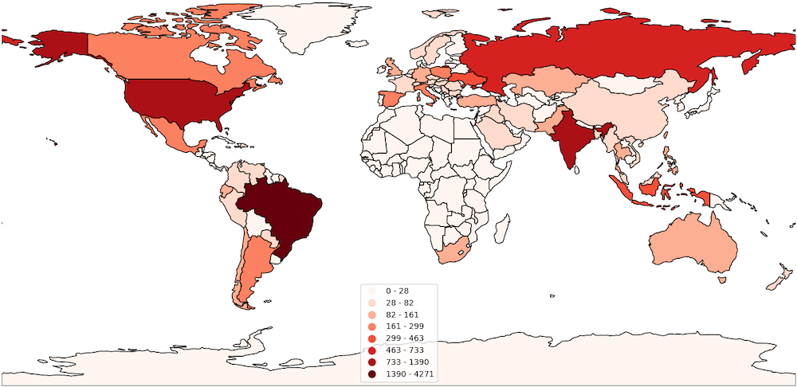
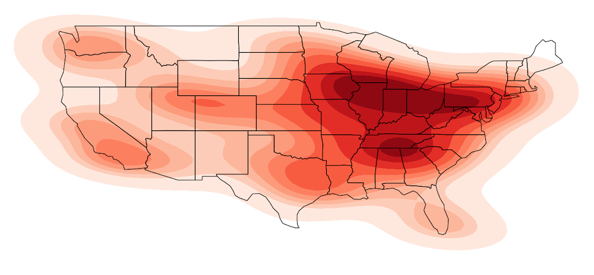

# How to create a density plot

~~~json
{
    "id" : "how_to_create_a_density_plot",
    "visibility" : "public",
    "name" : "How to create a density plot",
    "description" : "Using Geopandas to generate geoplots from data.",
    "links": [],
    "tags" : [],
    "authors":[
        {
            "person": "person:masser-frye__richard",
            "organizations": ["CAIDA, San Diego Supercomputer Center, University of California San Diego"]
        }
    ]   
}
~~~

## Introduction

The following contains information on creating density maps, i.e. maps where the density of something is indicated by color or some other signifier. Two techniques will be explored: choropleths, in which a map is divided into regions (in this case countries) then each country is shaded based on some value, and heatmaps, which use [kernel density estimation (KDE)](https://en.wikipedia.org/wiki/Kernel_density_estimation) to produce smooth boundaries.

This recipe will demonstrate how to generate such maps using [GeoPandas](https://geopandas.org/en/stable/index.html) and [GeoPlot](https://residentmario.github.io/geoplot/).

### Scripts

|Name|Description|
|---|---|
|generate_choropleth.py|Render a choropleth from a CSV file|
|generate_kde_map.py|Render a heatmap from a CSV file|
|add_coords_weight.py|Generate a file with weighted coordinate pairs from a file containing unweighted coordinate pairs|
|coords_to_countries.py|Generate a file with weighted country codes from a file that has coordinate pairs|

### Installing requirements with pip

All the requirements for every script in this recipe can be installed at once using pip. Download requirements.txt and then run the command
```
pip install -r requirements.txt
```

## Generating a Choropleth



**generate_choropleth.py** is a very basic script that will produce a choropleth from a table that contains country codes and corresponding values. One may also wish to use GeoPlot directly to customize their choropleths.

coords_to_countries.py is another script that uses a package called reverse_geocode to convert a table of coordinate pairs to a table of country codes and values that can be used as input for generate_choropleth.py.

### generate_choropleth.py

#### Requirements

GeoPandas, GeoPlot, Pandas, Matplotlib, MapClassify, and Pycountry_Convert.

#### Usage

generate_choropleth.py takes as input a CSV file with two columns: one labelled 'country' which has country codes ([ISO 3166-1 A2](https://en.wikipedia.org/wiki/ISO_3166-1_alpha-2) and [ISO 3166-1 A3](https://en.wikipedia.org/wiki/ISO_3166-1_alpha-3) accepted), and one labelled 'weight' which has a value corresponding to each country (not every country has to have a value; countries with no value will be assigned a value of 0).

Run the script like this:
```
python generate_choropleth.py -f [name of input file]
```
Optional flags:
- -t (add a title)
- -b (change the number of bins, see Background)

For example, the above image was generated with the command `python generate_choropleth.py -f ookla_server_locations_countries.csv`

### Using GeoPlot

GeoPlot's choropleth function, `geoplot.choropleth()`, requires as input a GeoDataFrame with a geometry column (i.e. a column containing, for each region, geometric information concerning the shape and location of that region) and a column that dictates how each region will be shaded. Conveniently, GeoPandas comes with a GeoDataFrame containing the geometries of the world's countries, which can be accessed with
```
geopandas.read_file(geopandas.datasets.get_path('naturalearth_lowres'))
```
An easy way to make a choropleth is merging *your* data with this built-in GeoDataFrame and then running `geoplot.choropleth()` on the merged table. Specify which column contains the density values with `hue` and specify the color of the map with `cmap`. See [documentation](https://residentmario.github.io/geoplot/api_reference.html#geoplot.geoplot.choropleth).

As explained in the Background section, using a bin system may improve the readability of your choropleth. [Mapclassify](https://pysal.org/mapclassify/api.html) is a good package for generating binning schemes.

### coords_to_countries.py

#### Requirements

[Reverse_geocode](https://github.com/richardpenman/reverse_geocode) and Pandas.

Note: on some computers and some versions of Python reverse_geocode runs into character encoding errors. If you encounter these errors, find where the source code of reverse_geocode is on your computer, delete \_\_init\_\_.py, and replace it with the version from here: [https://github.com/blushingpenguin/reverse_geocode/blob/specify_fs_encoding/\_\_init\_\_.py](https://github.com/blushingpenguin/reverse_geocode/blob/specify_fs_encoding/__init__.py)

#### Usage

This script takes as input a CSV file with a column for latitudes (labelled 'lat') and a column for longitudes (labelled 'long'). The input file can also have a weight column (i.e. a column counting the number of occurences of each coordinate pair) but doesn't have to. If the input file does have one, it should be labelled 'weight'.

Run the script like this:
```
python coords_to_countries.py -f [name of input file]
```

For example, the file ookla_server_locations_countries.csv was generated with the command `python coords_to_countries.py -f ookla_server_locations.csv`

## Generating a Heatmap



**generate_kde_map.py** is a script that will generate a heatmap from a list longitudes and latitudes. This section will also explain how to create a heatmap using GeoPlot.

add_coords_weight.py is another script which takes a list of latitudes and longitudes and counts how many times each pair occurs. This is done by coords_to_countries.py and generate_kde_map.py automatically, but those scripts do not save the resulting table. 

### generate_kde_map.py

#### Requirements

Pandas, GeoPandas, Matplotlib, and GeoPlot.

#### Usage

This script takes as input a CSV file with a column for latitudes (labelled 'lat') and a column for longitudes (labelled 'long'). The input file can also have a weight column (i.e. a column counting the number of occurences of each coordinate pair) but doesn't have to. If the input file does have one, it should be labelled 'weight'.

Run the script like this:
```
python generate_kde_map.py -f [name of input file]
```
Optional flags:
- -t (add a title)
- -b (adjust the plot smoothing by entering a number, default is 0.15 for Earth and 0.7 for US)
- -us (only render the United States)

For example, the image above was generated with the command `python generate_kde_map.py -f ookla_server_locations_usa_only.csv -us`.

### Using GeoPlot

GeoPlot's function for creating heatmaps is `geoplot.kdeplot()`. It takes as input a GeoDataFrame in which each row's geometry is a single point. Example code for constructing such a GeoDataFrame is
```
geopandas.GeoDataFrame(df, geometry=geopandas.points_from_xy(df.long, df.lat))
```
where `df` is a DataFrame containing latitudes and longitudes.

Importantly, `kdeplot` will only render the density blobs; it won't render the map underneath it. In order to do this, and have the maps be aligned, save the axes that are returned by `kdeplot`, then use them as input for a function that can render a map, like `geoplot.polyplot()`. An example of this would be
```
map_axes = geoplot.kdeplot(add params here)
geoplot.polyplot(map, ax=map_axes)
```
The granularity of the plot can be adjusted with the parameter `bw_adjust` and the color with `cmap`. See the [documentation provided by GeoPlot](https://residentmario.github.io/geoplot/api_reference.html#geoplot.geoplot.kdeplot) and the [additional documentation provided by Seaborn](https://seaborn.pydata.org/generated/seaborn.kdeplot.html#seaborn.kdeplot).

### add_coords_weight.py

#### Requirements

Pandas.

#### Usage

This script takes as input a CSV file with two columns. It counts the number of occurences of each row, condenses identical rows, and adds a new column called 'weight'.

Run it like so:
```
python add_coords_weight.py -f [name of input file]
```

## Background

### What is a density map/plot?

A density map, or density plot, shows the geographic concentrations of some set of things. Two common types of density maps are choropleths and heatmaps.

### What is a choropleth?

A choropleth is a map generated by dividing an area into subregions, and then giving them certain shades to indicate information. For example, a choropleth of the United States might use states or counties as subregions. A choropleth based on US states wouldn't be able to tell a viewer the difference between Northern California and Southern California, because each state would only be assigned one value.

#### What are 'bins'?

A choropleth whose shades are directly proportional to the input values will be harder to interpret if some countries have values that are orders of magnitude greater than other countries' values. Thus, we create "bins" which roughly correspond to different orders of magnitude, and then sort countries into these bins and use them to color our choropleth.

For example, suppose we're making a choropleth showing how many servers owned by some company are in each country. If one country has 5000 servers, then a proportionally-plotted choropleth would not perceptibly show a difference between a country that has 50 and a country that has 100; that difference would get flattened. If we use a bin system where there are separate bins for countries with 1-60 servers and 61-150, then the difference between a country with 50 and a country with 100 would be more visible.

### What is a heatmap, and what is kernel density estimation?

Unlike a choropleth, heatmaps do not rely on subregions to display information. Instead, they take a bunch of individual points and apply 2-dimensional [kernel density estimation (KDE)](https://en.wikipedia.org/wiki/Kernel_density_estimation). KDE is a technique for using a set of points to make density estimations for _all_ points. Unlike choropleths, the output here is a gradient that disregards borders.

### What are GeoPandas and GeoPlot?

GeoPandas is a package for working with GeoDataFrames, which are similar to DataFrames, but each row represents some region, and a 'geometry' column provides information on the borders of each region. 

GeoPlot is a package that allows the user to visually render GeoDataFrames in several different ways. It relies on Matplotlib and Seaborn.

## Caveats

- generate_choropleth.py only creates maps of the world, and not individual countries
- generate_kde_map.py can only make a world map or a map of the US, and not any other country