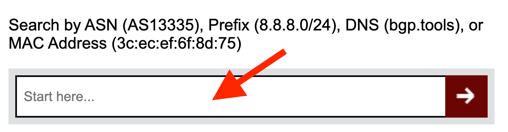
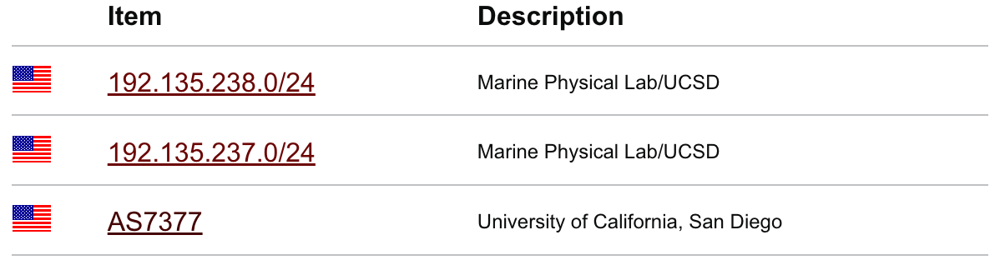
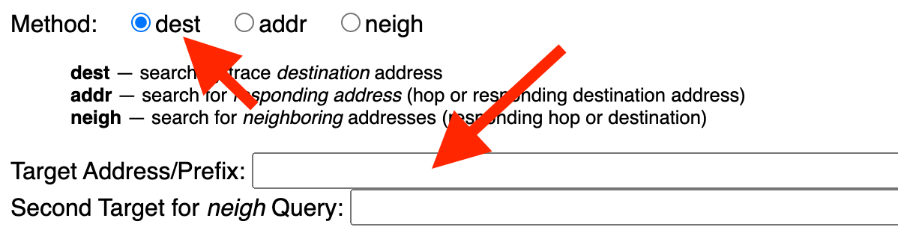
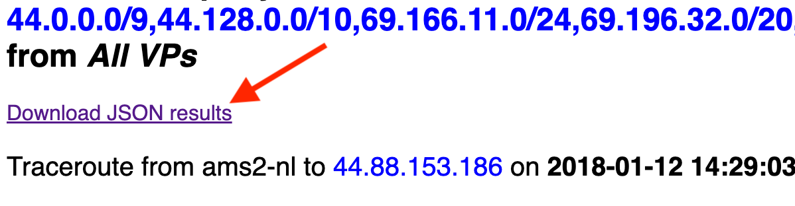

~~~json
{
  "id": "how_to_use_fantail_to_find_the_ip_paths_into_an_organization_from_ark",
  "name": "How to use FANTAIL to find which paths Ark nodes take to a given organization?",
  "description": "This will provide a recipe to find a company's prefixes and the IP paths from CAIDA's ark to those prefixes.",
  "links": [
    {
      "to": "dataset:bgptools"
    },
    {
      "to": "software:fantail"
    },
    {
      "to": "recipe:how_to_parse_ark_traces"
    }
  ],
  "tags": [
    "measurement methodology",
    "topology",
    "software/tools",
    "ipv4",
    "ipv4 prefix"
  ],
  "authors":[
        {
            "person": "person:huffaker_bradley",
            "organizations": [ "CAIDA, San Diego Supercomputer Center, University of California San Diego" ]
        }
    ]
}
~~~
### Introduction
We will be using BGPTools to identify the set of prefixes that are announced by the organization, and 
Fantail to collect the Ark traces to the those prefixes.

### Collect Prefixes  (bgptools)
- Go to **bgp.tools** and type the organization name into the "Start here..." field. 
  

    
  

   - The organization can be any organization that might have a AS number. For this example, please type in "UCSD". 

- Choose the best **AS number** on in the "Item" column for your organization.
  

    
  

   - In our example, the best match would be **AS7377**, for the University of California, San Diego.

- Download **https://bgp.tools/table.txt** and get all the prefixes for **AS number** by using the bash command below:

  ~~~
  wget https://bgp.tools/table.txt
  grep ' 7377$' table.txt | grep -v ':' | cut -f 1 -d ' ' - | tr '\n' ',' | sed 's/.\{1\}$//' > prefixes.txt 
  ~~~ 
- The results should output something like this on your terminal:
  ~~~
  --2024-05-16 11:32:05--  https://bgp.tools/table.txt
  Resolving bgp.tools (bgp.tools)... 2a0c:2f07:9459:443::247, 185.230.223.150
  Connecting to bgp.tools (bgp.tools)|2a0c:2f07:9459:443::247|:443... connected.
  HTTP request sent, awaiting response... 200 OK
  Length: unspecified [text/plain]
  Saving to: 'table.txt.2'

  table.txt.2             [ <=>                ]  26.32M  4.93MB/s    in 7.9s    

  2024-05-16 11:32:14 (3.31 MB/s) - 'table.txt.2' saved [27597933]
  ~~~

### Collect Traces (by using fantail) 
- Log into **fantail.caida.org** and select **Query traceroute paths**
  

    
  

- Inside the **Query** box, set **Method** to **[ ] dest** and copy/paste the prefixes from **prefixes.txt** file into the **Target Address/Prefix** field. 

  

    
  

   - In our example, the prefixes that would be pasted in are: `44.0.0.0/9,44.128.0.0/10,69.166.11.0/24,69.196.32.0/19,69.196.32.0/20,69.196.40.0/24,128.54.0.0/16,132.239.0.0/16,137.110.0.0/16,169.228.0.0/16,192.135.237.0/24,192.135.238.0/24,192.154.1.0/24,198.134.135.0/24,207.34.0.0/24,216.21.14.0/24,216.151.34.0/24,216.151.38.0/24`

- After filling in the **Target Address/Prefix** field, we will **submit** the query by scrolling to the bottom and pressing the "submit" button. Now, you may have to wait for the **Query Results** page to load. 

- Once it has loaded, download **JSONL results**
  This will download the trace in a JSONL file with a single trace per line as a complete JSON object. 
  

    
  

### Processing Traces 

- You can manually process each individual line with the following code snippet: 
    ~~~
    #!  /usr/bin/env python3 
    import sys
    import json 
    
    with open(sys.argv[1]) as fin: 
        for line in fin:
            trace = json.loads(line)
            print (json.dumps(info, indent=4))
    ~~~

For full details on scamper traces reference 
<a href="https://catalog.caida.org/recipe/how_to_parse_ark_traces">How
to parse through an ark traceroute?</a> recipe.

